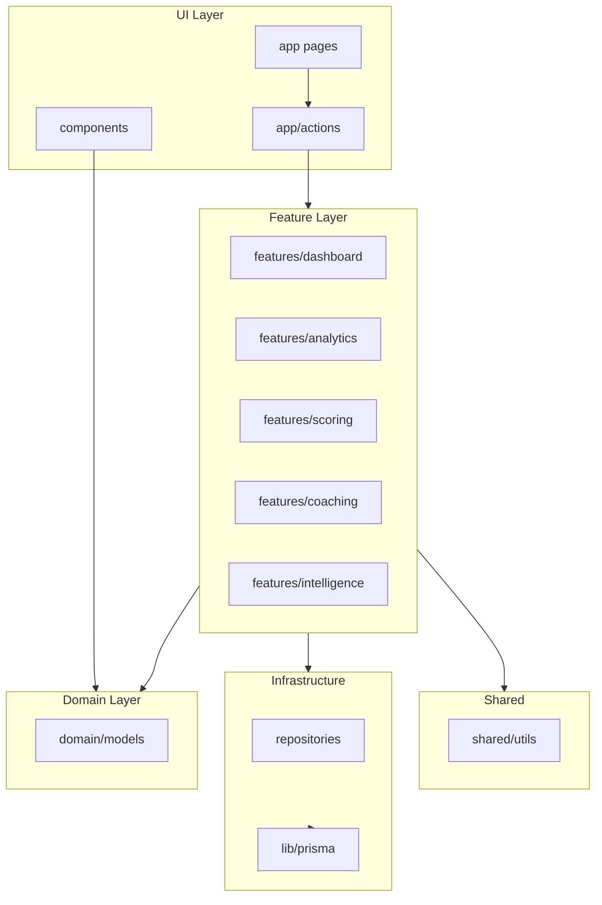

# ASCEND Architecture

Feature-first layout separating **UI**, **domain logic**, and **data access**. Existing routes, server actions, and component APIs are preserved; `lib/` paths remain as compatibility shims where noted.

## Folder structure

```
progressrx/
├── app/                          # Next.js routes (UI shell + thin server actions)
│   ├── (app)/                    # Authenticated pages — presentation only
│   └── actions/                  # Server action facades (auth, revalidation, forms)
│
├── components/                   # React UI (no business logic / Prisma)
│
├── domain/                       # Shared domain models & types
│   └── models/
│       ├── athlete.ts
│       ├── workout.ts
│       ├── sport.ts
│       ├── benchmark.ts
│       ├── goal.ts
│       ├── competition.ts
│       └── analytics.ts
│
├── features/                     # Feature modules (business logic)
│   ├── analytics/
│   ├── benchmarks/
│   ├── coaching/
│   ├── dashboard/
│   ├── goals/
│   ├── intelligence/
│   ├── personal-bests/
│   ├── predictions/
│   ├── scoring/
│   ├── sport/
│   └── workouts/
│
├── infrastructure/               # Data access
│   └── database/
│       ├── client.ts
│       └── repositories/
│
├── services/
│   └── athlete-intelligence/
│
├── shared/                       # Pure utilities
│   ├── constants/
│   └── utils/
│
└── lib/                          # Legacy shims + static catalogs
```

## Layer responsibilities

| Layer | Responsibility | May import |
|-------|----------------|------------|
| `app/` pages | Render UI, call actions/services | `features/`, `components/`, `domain/` |
| `app/actions/` | Auth, mutations, revalidation | `features/`, `infrastructure/` |
| `components/` | Presentation only | `domain/` types |
| `features/` | Business rules, orchestration | `domain/`, `infrastructure/`, `shared/` |
| `infrastructure/` | Prisma repositories | `domain/` |
| `domain/` | Pure types | — |
| `shared/` | Math, charts, constants | `domain/` |

## Dependency diagram



## Adding a new sport

1. Extend `domain/models/sport.ts` and `lib/sports/registry.ts`.
2. Add filters in `lib/sport/workout-filter.ts`.
3. Register an intelligence plugin in `services/athlete-intelligence/sports/`.
4. Add scoring/analytics/dashboard services under `features/`.
5. Branch dashboard/analytics pages on `activeView`.

## Data flow (CrossFit dashboard)

```
dashboard/page.tsx
  → getCrossfitDashboardForUser()     [features/dashboard]
    → workoutFilterForView()            [infrastructure]
    → getAthleteScoreSnapshot()         [features/scoring]
    → generateAiInsights()              [features/coaching]
```
